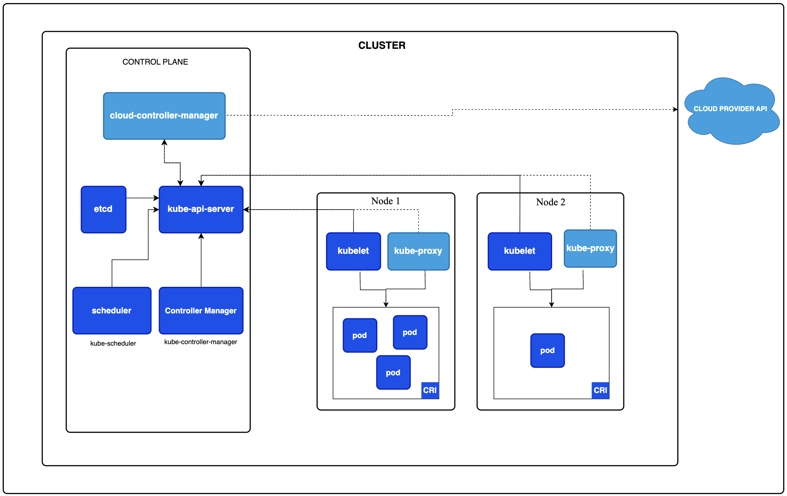

## Concepts

To learn about the concepts properly. The document ([Kubernetes Concepts](https://kubernetes.io/docs/concepts/)) from [kubernetes.io](https://kubernetes.io) is recommended

#### 1. Cluster Architecture

***NODES*** - These are also referred to as worker in master-worker architecture. These are the core machines (or VMs) where user load runs. Other than user load, nodes include **kubelet**, **container runtime** and **kube-proxy** as base components. ***[Click here for deeper understanding](https://kubernetes.io/docs/concepts/architecture/nodes/)***
******